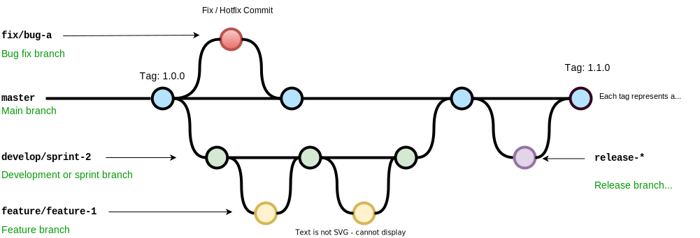

# Development Workflow

## Branching strategy

| name | description |
| :--- | :--- |
| master | main branch, production-ready, release is created by tagging commits in this branch |
| develop/{sprint-x} | derived from main branch, contains code for new features in the sprint |
| feature/{ticker-id}/{description} | derived from development branch. For developing new function. |
| fix/{ticker-id}/{name} | derived from main branch. For bug fix. |

Your branch name is automatically checked when committing by [git-branch-is](https://github.com/kevinoid/git-branch-is).




## 1. Start a new sprint

At the commencement of a new sprint, we create a **development branch** from the **main branch**, which serves as a container for commits related to new features being developed during that sprint.

```bash
git checkout master
git checkout -b 'develop/sprint-1'
git push --set-upstream origin 'develop/sprint-1'
```

*Typically, multiple related features are being developed, tested, and **released all at once**. Therefore, it is better to group releated features together in development branch instead of releasing them one by one.*


## 2. Start a new feature

Development of new features starting from the development branch.

1. Create a feature branch from the development branch.
    ```bash
    git checkout 'develop/sprint-1'
    git checkout -b 'feature/{ticket-id}/{description}'
    git push --set-upstream origin 'feature/{ticket-id}/{description}'
    ```
1. Code and update your pull request regularly.
1. Submit a **Draft** pull request.

*Submitting a pull request (PR) early on allows the team lead to monitor progress and give timely feedback.*


## 3. Finish a feature

1. Test the feature.
1. Change the pull request's status to **Ready** for reviewing.
1. Update PR base on reviewer's feedback.
1. Merge the PR (squash merge) into the development branch.

*Squash merge will consolidate all the changes from your development branch into a single commit on the main branch, making it easier to manage and review code changes.*


## 4. Finish a sprint

1. Perform User Acceptance Testing (UAT) for all tasks in development branch.
1. When it's time to release and deploy, submit a pull request to merge the development branch into the **main branch**.
1. Revert changelog and version number in manifest file if there're alpha releases created in development branch.
1. Merge the PR (squash merge) into the main branch.
1. Delete the development branch.


## 5. Start a bug fix

Bug fixes for the current version starting from the main branch.

1. Create a bug fix branch from the main branch.
    ```bash
    git checkout 'master'
    git checkout -b 'fix/{ticket-id}/{description}'
    git push --set-upstream origin 'fix/{ticket-id}/{description}'
    ```
1. Submit a Draft pull request.
1. Code and update your pull request regularly.


## 6. Finish a bug fix

1. Test the fix.
1. Change the pull request's status to **Ready** for reviewing.
1. Update PR base on reviewer's feedback.
1. Merge the PR (squash merge) into the main branch.
