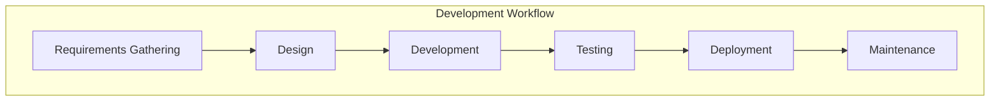

# Development Workflow

## Branching strategy

| name | description |
| :--- | :--- |
| master | main branch, contains latest stable, production-ready code|
| feature/{sprint-x} | derived from main branch, contains code for new features in the sprint |
| feature/{ticker-id}/{name} | derived from development branch. use it when you develop a new function. |
| fix/{ticker-id}/{name} | derived from main branch. use it when you fix bug. |

Your branch name is automatically checked when committing by [git-branch-is](https://github.com/kevinoid/git-branch-is).



## 1. Start a new sprint

At the commencement of a new sprint, we create a **development branch** from the **main branch**, which serves as a container for commits related to new features being developed during that sprint.

```bash
git checkout master
git checkout -b 'feature/sprint-1'
git push --set-upstream origin 'feature/sprint-1'
```

The reason why a **development branch** is needed is typically that multiple related features are being developed, tested, and **released all at once**. Therefore, it is better to group untested features together instead of releasing them one by one.


## 2. Develop new features

Steps to develop a new feature:

1. Create a feature branch from the development branch.
  ```bash
  git checkout 'feature/sprint-1'
  git checkout -b 'feature/{TICKET-ID}/{TICKET-DESCRIPTION}'
  git push --set-upstream origin 'feature/{TICKET-ID}/{TICKET-DESCRIPTION}'
  ```
2. Submit a **Draft** pull request.
3. Start coding and continue to update your pull request accordingly.
4. Once the new feature is completed, change the pull request's status to **Ready** for reviewing.
5. Finally, if the review process has been passed successfully, the PR will undergo a squash merge into the development branch.

We keep testing and updating the development branch until all features in the sprint pass User Acceptance Testing (UAT)


## 3. Deploy for internal testing

Typically during development, we need to deploy the application to the test environment to verify its functioning before releasing it.

This can be accomplished by creating an alpha release which can be submitted for testing. Run this command to create an alpha release:

```bash
yarn release:alpha
```

## 4. Release

Once all the features have been completed and passed testing (stable). It's time to create a new production release.

1. First, checkout the development branch:
    ```bash
    git checkout 'feature/sprint-1'
    ```
1. Generate a new version and update the changelog file by running the following command:
    ```bash
    yarn release
    ```
1. Submit a pull request to merge the development branch into the main branch.
1. To complete the merge, we recommend using a **squash merge**. This will consolidate all the changes from your development branch into a single commit on the main branch, making it easier to manage and review code changes.

After completing these steps, your changes will be merged into the main branch and ready for deployment. The development branch is discard (archived) to start the next sprint.


## 5. Deploy the latest stable code

```bash
yarn deploy
```


## 6. Bug fix

Bug fixes for the current version can be done by submiting pull request to the main branch.

1. Create a bug fix branch from the main branch.
  ```bash
  git checkout 'master'
  git checkout -b 'fix/{TICKET-ID}/{TICKET-DESCRIPTION}'
  git push --set-upstream origin 'fix/{TICKET-ID}/{TICKET-DESCRIPTION}'
  ```
1. Submit a **Draft** pull request.
1. Start coding and continue to update your pull request accordingly.
1. Once done, change the pull request's status to **Ready** for reviewing.
1. When the fix is ready to deploy, release a new version for the fix:
    ```bash
    yarn release
    ```
1. Merge the PR to the main branch (using a squash merge).
1. Checkout the main branch and deploy the fix:
    ```bash
    yarn deploy
    ```
